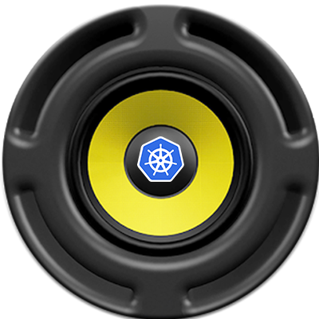

# SonicKube

<div align="right" style="float:right;margin-top:10px">
 
</div>

Sample integration of [Sonic-Pi](http://sonic-pi.net/) with [Kubernetes](http://kubernetes.io) events.

> The big idea here is to shift the focus of cluster monitoring from your eyes to
your ears.


This simple application will play different chords based on pod activity in a K8s cluster.

## Installation

* Install Sonic-Pi for your environment (http://sonic-pi.net/)
* Assumes you're running [Minikube](https://kubernetes.io/docs/tasks/tools/install-minikube/)
* Assumes your pods are running in the default namespace

Enable K8s master local access

```shell
kubectl proxy
```

## Fire Away!

The application will play a chord when pods come in an out of the cluster.

```shell
# First Launch Sonic Pi
# Then start our application...
go run main.go
```

Now Create and delete your pods and you should hear sounds!

---
 © 2017 Imhotep Software LLC.
All materials licensed under [Apache v2.0](http://www.apache.org/licenses/LICENSE-2.0)
